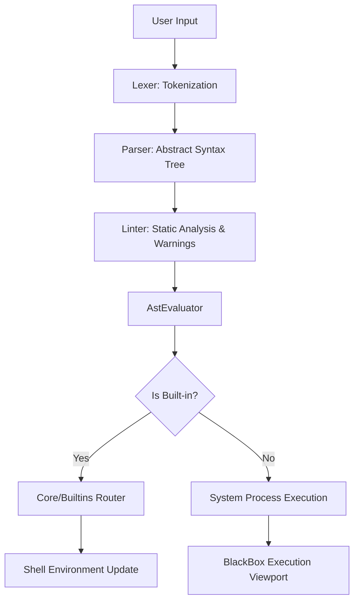

# AurSh Internals and Structure

**What it does**
AurSh is designed to be a modular, cross-platform shell. Under the hood, it is structured into several interconnected components that handle everything from parsing commands to drawing the beautiful TUI (Terminal User Interface).

This document explains the internal structure of the `src` directory and how the different pieces of AurSh work together.

---

## High-Level Architecture

At its core, AurSh operates in a continuous read-eval-print loop (REPL). It reads text, parses it into an actionable command, executes it, and then redraws the prompt.

---

## Directory Structure Breakdown

The codebase is split into distinct modules to keep things organized. Here is a simplified explanation of what each part does:

### 1. `core/` and `Program.cs`
This is the heart of the shell. It manages the main execution loop, environmental variables, and the `ShellEnvironment` state (including Call Stacks and Try-Catch scoping rules). `Program.cs` serves as the entry point that spins up the shell process.

### 2. The AST Engine (`core/Lexer.cs`, `core/Parser.cs`, `core/AstEvaluator.cs`)
Before any command runs, it is systematically processed:
- **Lexer**: Converts raw text into structured Tokens, correctly identifying quotes, nested subcommands, and redirections.
- **AST Parser**: Builds a hierarchical Abstract Syntax Tree (AST), understanding the relationships between `if` statements, pipelines, loops, and commands.
- **AstLinter**: A static analysis pass that warns the user about syntax mistakes (like unquoted variables or missing spaces in conditions) before they run.
- **AstEvaluator**: The execution engine that safely traverses the tree, executing pipelines concurrently and mapping function arguments.

### 3. `graphics/`
AurSh is built to be visually pleasing. This folder contains all the logic for drawing the modern two-line prompt, handling ANSI escape sequences, colors, and building visual elements for the TUI native tools (like `aursh-ls` and `aursh-cat`).

### 4. `blackbox/`
When you execute a standard operating system command (like `ping` or `npm install`), AurSh can encapsulate the output inside a beautiful Unicode box with rounded edges. The `blackbox` module intercepts the standard output of these child processes and draws the box around them in real-time.

### 5. `Contexts/`
Contexts are disk-backed, object-like variables unique to AurSh. This module handles saving and retrieving these variables from the `.aursh/` configuration directory, allowing you to persist complex data structures across different shell sessions.

### 6. `lua/` and `plugins/`
AurSh features an extensible plugin system. The `lua` module integrates a Lua interpreter directly into the shell, allowing users to write scripts that can interact with the shell's internal C# API. The `plugins` module manages the loading and unloading of these scripts.

### 7. `aursh-update/`
A standalone mini-program included with the shell. It lives separately so you can run updates with elevated privileges (like `sudo aursh-update`) without needing to run your entire interactive shell as the root user.

### 8. `BuiltinCommands.cs`
The router for native commands. Instead of spawning new processes, it matches commands like `cd`, `export`, or `aursh-plugin` to native C# functions, executing them instantly.

---

## Summary

By keeping the visual elements (`graphics`, `blackbox`) cleanly separated from the logical processing (`Parser`, `core`), AurSh remains highly maintainable while providing a fast and dynamic user experience across Windows, Linux, Android, and macOS.
